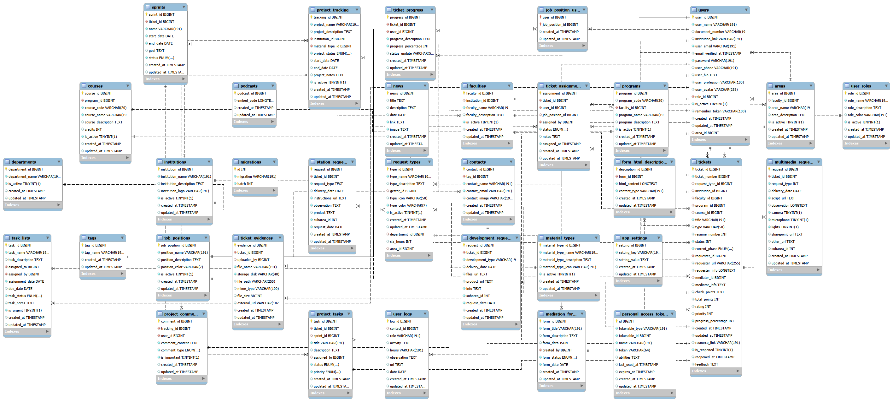
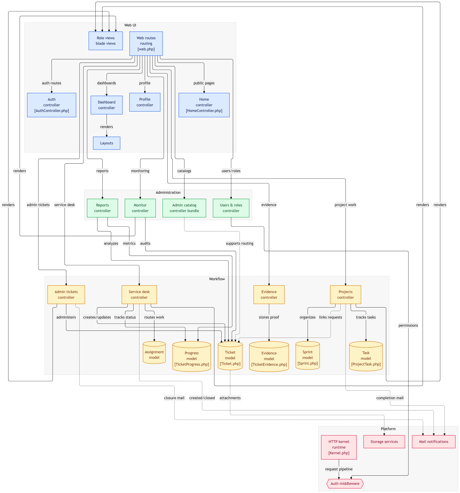

# 🚀 Mesa de Servicio Universidad Católica Luis Amigó
*(Anteriormente basado en Virtual Center - Metodología ADDIE)*

[](https://opensource.org/licenses/Apache-2.0)
[](https://doi.org/10.5281/zenodo.18841367)
[](https://laravel.com)
[](https://getbootstrap.com)

## Documentación Rápida

| Guía | Propósito |
|---|---|
| [GUIA_EJECUCION_LOCAL.md](GUIA_EJECUCION_LOCAL.md) | Levantar el proyecto en entorno local (Windows/PowerShell). |
| [GUIA_PROGRAMADORES.md](GUIA_PROGRAMADORES.md) | Flujo tecnico para desarrollo, testing y contribucion de codigo. |
| [GUIA_PRODUCCION.md](GUIA_PRODUCCION.md) | Despliegue productivo con prácticas operativas y de seguridad. |
| [RUNBOOK_PRODUCCION.md](RUNBOOK_PRODUCCION.md) | Checklist operativo corto para primera salida y actualizaciones en produccion. |
| [.github/PULL_REQUEST_TEMPLATE.md](.github/PULL_REQUEST_TEMPLATE.md) | Plantilla estandar para PR con DoD, riesgos, pruebas y rollback. |

## 📋 Descripción

La **Mesa de Servicio Universidad Católica Luis Amigó** es un sistema moderno diseñado para la gestión integral y colaboración virtual académica. Desarrollado bajo principios de la Ciencia Abierta, este software optimiza el flujo de trabajo resolviendo tickets, gestionando colaboradores mediante Sprints en esquema SCRUM, e impulsando la evaluación continua mediante Fases **ADDIE** (Analysis, Design, Development, Implementation, Evaluation).

Esta plataforma centraliza requerimientos académicos, de diseño y desarrollo, permitiendo conectar gestores, departamentos e infraestructura TI en un entorno en línea sin fricciones.

### Diagrama Relacional del Esquema del proyecto


### Novedades Recientes (Actualizado)

El sistema ha sido mejorado sustancialmente para incluir:
- 🔓 **Seguimiento Público Seguro**: Interfaz `/service-management/track-ticket` con validación por `document_number` + `ticket_number` para consultar progreso sin autenticación.
- 🖼️ **Captura de Evidencia Inline**: Integración nativa de editor enriquecido para adjuntar recortes o imágenes desde portapapeles.
- ⚙️ **Super Admin Técnico**: Gestión de parámetros técnicos en `app_settings` (rutas físicas de almacenamiento y personalización visual) sin afectar operación funcional.
- 🎨 **Personalización de Branding**: Exportación/importación de configuración visual y carga de logos/favicon desde panel técnico.
- 🗂️ **Almacenamiento Flexible de Evidencias**: Soporte para almacenamiento físico configurable con compatibilidad con esquemas anteriores.
- 🔄 **Auto-cierre basado en ADDIE**: Cierre controlado por progreso al 100% y fase válida del flujo de trabajo.
- 👥 **Asignación Múltiple en Tópicos**: Tópicos con varios colaboradores mediante tabla pivote `request_type_user` (compatibilidad con `gestor_id`).
- 📥 **Carga Masiva Administrativa (CSV)**: Módulo de importación con previsualización y plantillas descargables para:
	Usuarios, Roles, Tópicos, Puestos de Trabajo, Instituciones, Facultades, Áreas, Programas y Cursos.

---

## 🛠️ Tecnologías Clave

-   **Backend:** Laravel 10 (PHP 8.1+)
-   **Frontend:** Bootstrap 5, JavaScript Vanilla, AJAX, Editor Rich Text
-   **Base de Datos:** MySQL / MariaDB
-   **Autenticación:** Laravel Sanctum

---

## Requisitos del Sistema 📦

- PHP 8.1 o superior
- Composer
- Node.js y NPM
- MySQL 5.7+ / MariaDB 10.3+
- Servidor web (Apache/Nginx)

---

## Instalación ⚙️

### Inicio Rápido en Windows (PowerShell)

Si deseas levantar el proyecto local de forma directa en Windows, sigue estos pasos (sin reemplazar la guía detallada de esta sección):

```powershell
Set-Location "C:\Users\jean.montoyaca\Daniel\proyectosDaniel\app-services-ula"
composer install
npm install
Copy-Item .\env.example .\.env
php artisan key:generate
php artisan migrate
php artisan db:seed --class=UserRoleSeeder
php artisan db:seed --class=CreatePepitaAdmin
npm run dev
php artisan serve
```

Notas importantes:
- `composer.json` requiere PHP `^8.2`.
- En instalación limpia local, conviene usar seeders puntuales (`UserRoleSeeder` y `CreatePepitaAdmin`) para evitar dependencias de migración legacy.
- Login de prueba: `pepita@prueba.edu.co` / `password`.

También puedes consultar la guía operativa: `GUIA_EJECUCION_LOCAL.md`.

Para despliegue en servidores reales, revisa: `GUIA_PRODUCCION.md`.

### 1. Clonar el Proyecto

```bash
git clone https://github.com/DanielDev87/virtual-center-app
cd virtual-center-app
```

### 2. Instalar Dependencias

```bash
# Dependencias PHP
composer install

# Dependencias Node.js
npm install
```

### Scripts Importantes del Proyecto

Esta seccion centraliza los comandos principales para desarrollo, pruebas, mantenimiento y bootstrap de datos.

#### NPM (Frontend / Laravel Mix)

Definidos en `package.json`:

| Script | Comando | Uso |
|---|---|---|
| `dev` | `npm run dev` | Compila assets en modo desarrollo. |
| `watch` | `npm run watch` | Recompila assets al detectar cambios. |
| `watch-poll` | `npm run watch-poll` | Watch con polling (util en VMs o FS de red). |
| `hot` | `npm run hot` | Hot reload para desarrollo local. |
| `prod` | `npm run prod` | Compila assets minificados para produccion. |

#### Composer (ciclo de instalacion)

Definidos en `composer.json`:

| Script | Momento de ejecucion | Descripcion |
|---|---|---|
| `post-autoload-dump` | Despues de autoload | Descubre paquetes de Laravel automaticamente. |
| `post-update-cmd` | Despues de update | Publica assets de Laravel cuando aplica. |
| `post-root-package-install` | Instalacion inicial | Crea `.env` desde `env.example` si no existe. |
| `post-create-project-cmd` | Al crear proyecto | Genera `APP_KEY` inicial. |

#### Artisan (operacion diaria y administracion)

| Comando | Uso |
|---|---|
| `php artisan serve` | Levanta servidor local de desarrollo. |
| `php artisan migrate` | Ejecuta migraciones. |
| `php artisan db:seed --class=UserRoleSeeder` | Carga roles base del sistema. |
| `php artisan db:seed --class=CreatePepitaAdmin` | Crea admin inicial de prueba. |
| `php artisan test --filter=AdminBulkImport` | Ejecuta pruebas de carga masiva. |
| `php artisan db:reset-with-admin --force` | Reinicia BD y deja un unico admin de prueba. |
| `php artisan user:reset-password correo@dominio.com NuevaClave123*` | Resetea contrasena de un usuario existente. |
| `php artisan optimize:clear` | Limpia caches de config, rutas, vistas y eventos. |
| `php artisan config:cache` | Cachea configuracion para entornos productivos. |
| `php artisan route:cache` | Cachea rutas para mejorar performance. |
| `php artisan view:cache` | Precompila vistas Blade. |

#### Matriz Rapida por Entorno

| Entorno | Dependencias | Base de datos | Assets | Operacion |
|---|---|---|---|---|
| Local (dev) | `composer install` + `npm install` | `php artisan migrate` + seeders puntuales | `npm run dev` o `npm run watch` | `php artisan serve` |
| QA / Staging | `composer install --no-dev --optimize-autoloader` + `npm install` | `php artisan migrate --force` + seeders requeridos | `npm run prod` | `php artisan optimize:clear` y pruebas (`php artisan test`) |
| Produccion | `composer install --no-dev --optimize-autoloader` + `npm install` | `php artisan migrate --force` | `npm run prod` | `php artisan config:cache`, `php artisan route:cache`, `php artisan view:cache` |

Nota: para reiniciar completamente un entorno de pruebas y conservar solo un admin inicial, usar `php artisan db:reset-with-admin --force`.

### 3. Configurar Variables de Entorno

```bash
cp env.example .env
```

Editar el archivo `.env` con tus configuraciones:

```env
APP_NAME="Mesa de Servicio Universidad Católica Luis Amigó"
APP_ENV=local
APP_KEY=
APP_DEBUG=true
APP_URL=http://localhost

DB_CONNECTION=mysql
DB_HOST=127.0.0.1
DB_PORT=3306
DB_DATABASE=virtual_center_db
DB_USERNAME=root
DB_PASSWORD=tu_password
```

### 4. Compilar y Levantar

```bash
# General clave
php artisan key:generate

# Migrar y esparcir Catálogo Base
php artisan migrate

# Compilado de assets frontend
npm run dev
```

*(Si migras desde el sistema *Radio Station* anterior, puedes ejecutar `php artisan migrate:from-legacy`)*

---

## Jerarquía de Roles de Sistema 👥

El software estipula los siguientes estratos de acceso:

1. **Super Admin Técnico**: Configuración técnica de almacenamiento y branding, gestión de parámetros de infraestructura y soporte operativo técnico.
2. **Administrador (Admin)**: Gestión global funcional (usuarios, roles, tópicos, catálogos académicos, puestos, reportes, tickets y carga masiva).
3. **Admin Área**: Gestión de tickets y asignaciones restringida al área asociada al usuario.
4. **Monitor / Auditor**: Acceso de observación para reportes y analítica (modo solo lectura).
5. **Colaborador (Contributor)**: Ejecución operativa de tickets, tareas, sprints y actualización de progreso en flujo ADDIE/SCRUM.
6. **Solicitante (Requester)**: Creación y seguimiento de solicitudes, consulta de estado y calificación de servicio.

---

## Uso del Sistema 💻

- **URL Base / Tracking Público**: `http://localhost/service-management/track-ticket`
- **Login**: `/login`
- **Dashboard Autenticado**: `/dashboard`

### Modo Oscuro/Claro
Soporte absoluto entre temáticas claras u oscuras con persistencia guardada en disco por el navegador.

---

## Despliegue en Linux (Ubuntu/Debian) 🐧

Esta guía resume un despliegue productivo base en Linux sin reemplazar la documentación extendida de `GUIA_PRODUCCION.md`.

### 1. Instalar dependencias del sistema

```bash
sudo apt update
sudo apt install -y git unzip curl software-properties-common
sudo add-apt-repository ppa:ondrej/php -y
sudo apt update
sudo apt install -y php8.2 php8.2-cli php8.2-fpm php8.2-common php8.2-mysql php8.2-mbstring php8.2-xml php8.2-curl php8.2-zip php8.2-bcmath php8.2-gd
sudo apt install -y mysql-server nginx
curl -fsSL https://deb.nodesource.com/setup_20.x | sudo -E bash -
sudo apt install -y nodejs
```

Instalar Composer:

```bash
cd /tmp
php -r "copy('https://getcomposer.org/installer', 'composer-setup.php');"
php composer-setup.php
sudo mv composer.phar /usr/local/bin/composer
composer --version
```

### 2. Clonar el proyecto y preparar entorno

```bash
cd /var/www
sudo git clone https://github.com/DanielDev87/virtual-center-app app-services-ula
cd app-services-ula
sudo chown -R $USER:$USER .
composer install --no-dev --optimize-autoloader
npm install
npm run prod
cp env.example .env
php artisan key:generate
```

### 3. Configurar base de datos y migraciones

Editar `.env` con credenciales reales (`APP_ENV=production`, `APP_DEBUG=false`, `APP_URL=https://tu-dominio`).

Luego ejecutar:

```bash
php artisan migrate --force
php artisan db:seed --class=UserRoleSeeder --force
php artisan db:seed --class=CreatePepitaAdmin --force
php artisan config:cache
php artisan route:cache
php artisan view:cache
```

### 4. Permisos de archivos

```bash
sudo chown -R www-data:www-data /var/www/app-services-ula
sudo find /var/www/app-services-ula -type f -exec chmod 644 {} \;
sudo find /var/www/app-services-ula -type d -exec chmod 755 {} \;
sudo chmod -R 775 /var/www/app-services-ula/storage
sudo chmod -R 775 /var/www/app-services-ula/bootstrap/cache
```

### 5. Configurar Nginx

Crear `/etc/nginx/sites-available/app-services-ula`:

```nginx
server {
	listen 80;
	server_name tu-dominio.com;

	root /var/www/app-services-ula/public;
	index index.php index.html;

	location / {
		try_files $uri $uri/ /index.php?$query_string;
	}

	location ~ \.php$ {
		include snippets/fastcgi-php.conf;
		fastcgi_pass unix:/run/php/php8.2-fpm.sock;
	}

	location ~ /\.ht {
		deny all;
	}
}
```

Activar sitio:

```bash
sudo ln -s /etc/nginx/sites-available/app-services-ula /etc/nginx/sites-enabled/
sudo nginx -t
sudo systemctl restart nginx
sudo systemctl restart php8.2-fpm
```

### 6. Configurar procesos en segundo plano (recomendado)

Si usas colas o tareas programadas, agrega Supervisor y cron:

```bash
sudo apt install -y supervisor
```

Cron para scheduler de Laravel:

```bash
* * * * * cd /var/www/app-services-ula && php artisan schedule:run >> /dev/null 2>&1
```

### 7. SSL con Let's Encrypt (recomendado)

```bash
sudo apt install -y certbot python3-certbot-nginx
sudo certbot --nginx -d tu-dominio.com
```

### 8. Checklist de verificación post-despliegue

- `APP_ENV=production` y `APP_DEBUG=false` en `.env`.
- Aplicación responde en HTTPS.
- Inicio de sesión y tracking público funcionales.
- `storage/logs/laravel.log` sin errores críticos.
- Permisos correctos en `storage/` y `bootstrap/cache/`.
- Carga masiva CSV operativa para los catálogos habilitados.

---

## Diagrama de flujo lógico del App



---

## Estructura de Proyecto Interna 📁

```
app-services-ula/
├── .github/                 # Plantillas y automatización de colaboración (PR template)
├── app/
│   ├── Console/             # Comandos Artisan personalizados
│   ├── Http/Controllers/    # Controladores backend (tickets, reportes, auth, admin)
│   │   └── Admin/           # Gestion académica y carga masiva CSV
│   ├── Mail/                # Mailables del sistema
│   ├── Models/              # Modelos Eloquent y relaciones de dominio
│   │   ├── Course.php       # Curso con program() legado + programs() many-to-many
│   │   └── Program.php      # Programa con linkedCourses() para pivote
│   ├── Providers/           # Proveedores de servicios Laravel
│   └── Services/            # Servicios de negocio y almacenamiento (local/custom/drive)
├── bootstrap/               # Inicialización de Laravel y cache de arranque
├── config/                  # Configuración del framework y módulos (db, mail, queue, etc.)
├── database/
│   ├── factories/           # Factories para pruebas y seed
│   ├── migrations/          # Migraciones de esquema (incluye pivote course_program)
│   ├── seeders/             # Seeders de datos iniciales/legacy
│   └── tdeacpmapplication.sql
├── manuales/                # Documentación funcional por rol
├── public/                  # Entrada web y assets públicos compilados
├── resources/
│   ├── views/               # Vistas Blade (portal publico y panel admin)
│   │   └── admin/academic/  # Vistas de cursos, programas y formularios de gestion
│   ├── css/                 # Estilos fuente
│   ├── js/                  # Scripts fuente
│   └── img/                 # Recursos graficos fuente
├── routes/
│   ├── web.php              # Rutas web y middleware de permisos
│   ├── api.php              # Rutas API
│   └── console.php          # Rutas de consola
├── storage/                 # Logs, sesiones, cache y archivos de aplicacion
├── tests/
│   ├── Unit/               # Pruebas unitarias
│   └── Feature/            # Pruebas funcionales/integración
├── artisan                 # CLI de Laravel
├── env.example             # Variables de entorno de referencia
├── composer.json           # Dependencias PHP
├── package.json            # Dependencias frontend
├── phpunit.xml             # Configuración de pruebas y cobertura
└── webpack.mix.js          # Build frontend (Laravel Mix)
```

---

## Licencia ⚖️ 

Este proyecto está bajo los principios de la Ciencia Abierta y utiliza la licencia **Apache 2.0**. Puedes usarlo para fines comerciales, redistribuirlo o adaptarlo académicamente sin restricciones abusivas, siempre que no asumas que garantizamos soporte a su alteración. Para más detalles, consulta el archivo LICENSE.

## Soporte y Contacto 📞

Para soporte técnico, preguntas o reportar errores formales, por favor contacta al equipo de desarrollo originario o fork:

- **Desarrollador Principal**: Daniel Agudelo
- **Repositorio Oficial**: https://github.com/DanielDev87
- **Reportar Issues**: https://github.com/DanielDev87/virtual-center-app/issues

---

**Mesa de Servicio Universidad Católica Luis Amigó**  
*Impulsando la Ciencia Abierta y la transformación digital en la educación.*  
*Desarrollado con ❤️ por Daniel Agudelo usando Laravel y Bootstrap.*

<!-- ACTUALIZACION_JUNIO_2026 -->
## Novedades Funcionales (Junio 2026)

- Carga masiva CSV reforzada con lectura UTF-8 y manejo explicito de comillas dobles como encapsulador de texto.
- Validacion estructural por fila en importaciones CSV para detectar columnas rotas por delimitador/comillas antes de escribir en BD.
- Mejora de importacion de cursos para relacion muchos-a-muchos con programas mediante tabla pivote course_program (manteniendo compatibilidad con program_id legado).
- Carga masiva de cursos con soporte de multiples referencias: program_id/program_ids, program_code/program_codes y program_name/program_names.
- Resolucion de ambiguedades de programas mejorada con filtros por faculty_id/faculty_name e institution_id/institution_name.
- Cuando program_code/program_name es duplicado y no se envia desambiguacion, la importacion puede vincular el curso a todos los programas coincidentes.
- Formularios de crear/editar cursos mejorados con selector multiple con busqueda (Tom Select), conservando compatibilidad del campo program_id.

<!-- ACTUALIZACION_JULIO_2026 -->
## Novedades Funcionales (Julio 2026)

- La Mesa entra en fase de producción y ha surgido una nueva necesidad basada en los centros regionales...

- Existen tópicos que son gestionados por distintas regionales, la mesa ahora soporta la gestión por regionales creando las regionales desde la opción Instituciones desde el rol administrador.

- Se actualiza el nível de prioridad por defecto en bajo para que los solicitantes seleccionen entre las opciones el que se ajuste.

- Cuando se selecciona Alta o Urgente es obligatorio diligenciar el por qué es de ese nivel de prioridad.

- Cuando un solicitante va a calificar un servicio con menos de 5 estrellas se habilita la opción de argumentar el por qué de esa calificación buscando la mejora de los procesos de servicio.

- Un solicitante no podrá realizar mas solicitudes si no ha calificado sus servicios anteriores.

