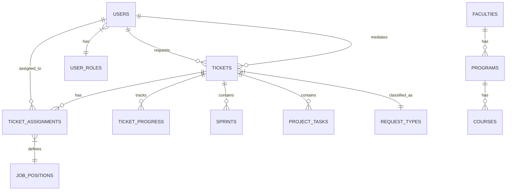

# Manual de Base de Datos - Sistema A-DDIE
## Diccionario de Datos y Estructura

---

## Tabla de Contenidos

1. [Introducción](#introducción)
2. [Diagrama ER (Entidad-Relación)](#diagrama-er)
3. [Diccionario de Datos](#diccionario-de-datos)
    - [Usuarios y Roles](#usuarios-y-roles)
    - [Gestión de Tickets](#gestión-de-tickets)
    - [Gestión de Proyectos (SCRUM)](#gestión-de-proyectos-scrum)
    - [Catálogos Académicos](#catálogos-académicos)
    - [Otros Catálogos](#otros-catálogos)
4. [Relaciones Principales](#relaciones-principales)

---

## Introducción

Este documento describe la estructura de la base de datos del sistema A-DDIE. La base de datos está diseñada para soportar la gestión de tickets de servicios educativos, asignación de múltiples colaboradores, seguimiento de progreso acumulativo y gestión de proyectos bajo metodologías ADDIE y SCRUM.

**Motor de Base de Datos**: MySQL / MariaDB  
**Charset**: utf8mb4  
**Collation**: utf8mb4_unicode_ci

---

## Diagrama ER

Representación textual de las relaciones principales:

---

## Diccionario de Datos

### Usuarios y Roles

#### `users`
Almacena la información de todos los usuarios del sistema.

| Columna | Tipo | Restricciones | Descripción |
|---------|------|---------------|-------------|
| `user_id` | BIGINT | PK, AI | Identificador único del usuario |
| `user_name` | VARCHAR(255) | NOT NULL | Nombre completo del usuario |
| `user_email` | VARCHAR(255) | UNIQUE, NOT NULL | Correo electrónico (login) |
| `email_verified_at` | TIMESTAMP | NULLABLE | Fecha de verificación de email |
| `password` | VARCHAR(255) | NOT NULL | Contraseña hasheada (Bcrypt) |
| `user_phone` | VARCHAR(255) | NULLABLE | Teléfono de contacto |
| `user_bio` | TEXT | NULLABLE | Biografía o descripción breve |
| `user_avatar` | VARCHAR(255) | NULLABLE | Ruta a la imagen de perfil |
| `role_id` | BIGINT | FK -> user_roles | Rol asignado al usuario |
| `is_active` | BOOLEAN | DEFAULT TRUE | Estado de la cuenta |
| `remember_token` | VARCHAR(100) | NULLABLE | Token para "Recordarme" |
| `created_at` | TIMESTAMP | NULLABLE | Fecha de creación |
| `updated_at` | TIMESTAMP | NULLABLE | Fecha de última actualización |

#### `user_roles`
Define los roles de seguridad y acceso.

| Columna | Tipo | Restricciones | Descripción |
|---------|------|---------------|-------------|
| `role_id` | BIGINT | PK, AI | Identificador del rol |
| `role_name` | VARCHAR(255) | NOT NULL | Nombre (Admin, Monitor, Contributor, Requester) |
| `role_description` | TEXT | NULLABLE | Descripción de permisos |
| `role_color` | VARCHAR(255) | NULLABLE | Color para UI |
| `is_active` | BOOLEAN | DEFAULT TRUE | Estado del rol |

---

### Gestión de Tickets

#### `tickets`
Tabla central que almacena las solicitudes de servicio.

| Columna | Tipo | Restricciones | Descripción |
|---------|------|---------------|-------------|
| `ticket_id` | BIGINT | PK, AI | Identificador interno |
| `ticket_number` | BIGINT | UNIQUE | Número visible del ticket |
| `title` | VARCHAR(255) | NOT NULL | Título de la solicitud |
| `type` | INTEGER | NOT NULL | Tipo numérico (Legacy) |
| `request_type_id` | BIGINT | FK -> request_types | Tipo de solicitud (Catálogo) |
| `status` | INTEGER | NOT NULL | 1=Pendiente, 2=En Progreso, 3=Completado, 4=Cancelado |
| `priority` | INTEGER | NULLABLE | Nivel de prioridad |
| `progress_percentage` | INTEGER | DEFAULT 0 | Progreso acumulativo (0-100) |
| `current_phase` | ENUM | DEFAULT 'Analysis' | Fase ADDIE actual |
| `requester_id` | BIGINT | FK -> users | Usuario que creó el ticket |
| `mediator_id` | BIGINT | FK -> users | Mediador principal (opcional) |
| `resource_link` | VARCHAR(255) | NULLABLE | URL del entregable final |
| `is_reopened` | BOOLEAN | DEFAULT FALSE | Indica si fue reabierto |
| `reopened_at` | TIMESTAMP | NULLABLE | Fecha de última reapertura |
| `rating` | INTEGER | NULLABLE | Calificación (1-5) |
| `feedback` | TEXT | NULLABLE | Retroalimentación del usuario |
| `created_at` | TIMESTAMP | NULLABLE | Fecha de creación |
| `updated_at` | TIMESTAMP | NULLABLE | Fecha de actualización |

#### `ticket_assignments`
Gestiona la asignación de múltiples colaboradores a un ticket.

| Columna | Tipo | Restricciones | Descripción |
|---------|------|---------------|-------------|
| `assignment_id` | BIGINT | PK, AI | Identificador de asignación |
| `ticket_id` | BIGINT | FK -> tickets | Ticket asociado |
| `user_id` | BIGINT | FK -> users | Colaborador asignado |
| `job_position_id` | BIGINT | FK -> job_positions | Rol/Puesto en este ticket |
| `assigned_by` | BIGINT | FK -> users | Quién realizó la asignación |
| `status` | ENUM | DEFAULT 'active' | 'active', 'completed', 'removed' |
| `notes` | TEXT | NULLABLE | Notas de asignación |
| `assigned_at` | TIMESTAMP | DEFAULT CURRENT | Fecha de asignación |

#### `ticket_progress`
Historial detallado de avances.

| Columna | Tipo | Restricciones | Descripción |
|---------|------|---------------|-------------|
| `progress_id` | BIGINT | PK, AI | Identificador de progreso |
| `ticket_id` | BIGINT | FK -> tickets | Ticket asociado |
| `user_id` | BIGINT | FK -> users | Usuario que reporta |
| `progress_description` | TEXT | NOT NULL | Descripción de lo realizado |
| `progress_percentage` | INTEGER | DEFAULT 0 | Porcentaje reportado |
| `created_at` | TIMESTAMP | NULLABLE | Fecha del reporte |

---

### Gestión de Proyectos (SCRUM)

#### `sprints`
Periodos de trabajo para metodología SCRUM.

| Columna | Tipo | Restricciones | Descripción |
|---------|------|---------------|-------------|
| `sprint_id` | BIGINT | PK, AI | Identificador del sprint |
| `ticket_id` | BIGINT | FK -> tickets | Ticket padre |
| `name` | VARCHAR(255) | NOT NULL | Nombre del sprint |
| `start_date` | DATE | NOT NULL | Fecha inicio |
| `end_date` | DATE | NOT NULL | Fecha fin |
| `goal` | TEXT | NULLABLE | Objetivo del sprint |
| `status` | ENUM | DEFAULT 'planned' | 'planned', 'active', 'completed' |

#### `project_tasks`
Tareas individuales (Kanban).

| Columna | Tipo | Restricciones | Descripción |
|---------|------|---------------|-------------|
| `task_id` | BIGINT | PK, AI | Identificador de tarea |
| `ticket_id` | BIGINT | FK -> tickets | Ticket padre |
| `sprint_id` | BIGINT | FK -> sprints | Sprint asignado (opcional) |
| `title` | VARCHAR(255) | NOT NULL | Título de la tarea |
| `description` | TEXT | NULLABLE | Detalles |
| `assigned_to` | BIGINT | FK -> users | Responsable |
| `status` | ENUM | DEFAULT 'todo' | 'todo', 'in_progress', 'review', 'done' |
| `priority` | ENUM | DEFAULT 'medium' | 'low', 'medium', 'high' |

---

### Catálogos Académicos

#### `faculties`
Facultades de la institución.

| Columna | Tipo | Restricciones | Descripción |
|---------|------|---------------|-------------|
| `faculty_id` | BIGINT | PK, AI | Identificador |
| `faculty_name` | VARCHAR(255) | NOT NULL | Nombre de la facultad |

#### `programs`
Programas académicos.

| Columna | Tipo | Restricciones | Descripción |
|---------|------|---------------|-------------|
| `program_id` | BIGINT | PK, AI | Identificador |
| `faculty_id` | BIGINT | FK -> faculties | Facultad a la que pertenece |
| `program_name` | VARCHAR(255) | NOT NULL | Nombre del programa |

#### `courses`
Cursos o materias.

| Columna | Tipo | Restricciones | Descripción |
|---------|------|---------------|-------------|
| `course_id` | BIGINT | PK, AI | Identificador |
| `program_id` | BIGINT | FK -> programs | Programa al que pertenece |
| `course_code` | VARCHAR(20) | NOT NULL | Código del curso |
| `course_name` | VARCHAR(255) | NOT NULL | Nombre del curso |
| `credits` | INTEGER | NULLABLE | Créditos académicos |
| `is_active` | BOOLEAN | DEFAULT TRUE | Estado |

---

### Otros Catálogos

#### `request_types`
Tipos de servicios disponibles.

| Columna | Tipo | Restricciones | Descripción |
|---------|------|---------------|-------------|
| `type_id` | BIGINT | PK, AI | Identificador |
| `type_name` | VARCHAR(100) | NOT NULL | Nombre (Diseño, Web, Video...) |
| `type_icon` | VARCHAR(50) | NULLABLE | Clase de icono FontAwesome |
| `type_color` | VARCHAR(7) | DEFAULT '#6c757d' | Color Hex |

#### `job_positions`
Puestos de trabajo para colaboradores.

| Columna | Tipo | Restricciones | Descripción |
|---------|------|---------------|-------------|
| `job_position_id` | BIGINT | PK, AI | Identificador |
| `position_name` | VARCHAR(255) | NOT NULL | Nombre del puesto |
| `position_color` | VARCHAR(7) | NULLABLE | Color identificador |

---

## Relaciones Principales

### Tickets y Usuarios
- Un **Ticket** pertenece a un **Solicitante** (`requester_id`).
- Un **Ticket** puede tener un **Mediador Principal** (`mediator_id`).
- Un **Ticket** tiene muchos **Colaboradores** a través de `ticket_assignments`.

### Estructura Académica
- Una **Facultad** tiene muchos **Programas**.
- Un **Programa** tiene muchos **Cursos**.

### Gestión de Proyectos
- Un **Ticket** puede tener múltiples **Sprints**.
- Un **Ticket** tiene muchas **Tareas**.
- Una **Tarea** puede pertenecer a un **Sprint**.
- Una **Tarea** puede estar asignada a un **Usuario**.

---

**Generado**: Diciembre 2025  
**Sistema**: A-DDIE v1.0
