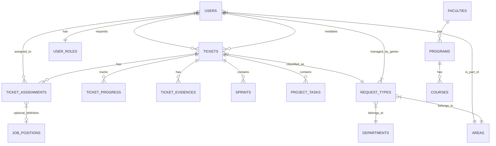

# Manual de Base de Datos - Sistema Virtual Center
## Diccionario de Datos y Estructura

---

## Tabla de Contenidos

1. [Introducción](#introducción)
2. [Diagrama ER (Entidad-Relación)](#diagrama-er)
3. [Diccionario de Datos](#diccionario-de-datos)
    - [Usuarios y Roles](#usuarios-y-roles)
    - [Gestión de Tickets y Evidencias](#gestión-de-tickets-y-evidencias)
    - [Gestión de Proyectos (SCRUM)](#gestión-de-proyectos-scrum)
    - [Catálogos Académicos e Institucionales](#catálogos-académicos-e-institucionales)
    - [Configuraciones del Sistema](#configuraciones-del-sistema)
4. [Relaciones Principales](#relaciones-principales)

---

## Introducción

Este documento describe la estructura de la base de datos del sistema Virtual Center. La base de datos está diseñada para soportar la gestión algorítmica de tickets de servicios educativos de la institución, asignación multi-mediador flexible, seguimiento de progreso acumulativo, evidencias multimedia online y la gestión exhaustiva bajo las fases ADDIE y flujos SCRUM.

**Motor de Base de Datos**: MySQL / MariaDB  
**Charset**: utf8mb4  
**Collation**: utf8mb4_unicode_ci

---

## Diagrama ER

Representación textual de las relaciones principales:

```mermaid
erDiagram
    USERS ||--o{ TICKETS : requests
    USERS ||--o{ TICKETS : mediates
    USERS ||--o{ TICKET_ASSIGNMENTS : assigned_to
    USERS }|--|| USER_ROLES : has
    USERS }|--|| AREAS : is_part_of
    TICKETS ||--o{ TICKET_ASSIGNMENTS : has
    TICKETS ||--o{ TICKET_PROGRESS : tracks
    TICKETS ||--o{ TICKET_EVIDENCES : has
    TICKETS ||--o{ SPRINTS : contains
    TICKETS ||--o{ PROJECT_TASKS : contains
    TICKETS }|--|| REQUEST_TYPES : classified_as
    TICKET_ASSIGNMENTS }|--o| JOB_POSITIONS : optional_definition
    REQUEST_TYPES }|--|| DEPARTMENTS : belongs_to
    REQUEST_TYPES }|--|| AREAS : belongs_to
    REQUEST_TYPES }|--|| USERS : managed_by_gestor
    FACULTIES ||--o{ PROGRAMS : has
    PROGRAMS ||--o{ COURSES : has
```

---

## Diccionario de Datos

### Usuarios y Roles

#### `users`
Almacena la información de todos los usuarios del sistema.

| Columna | Tipo | Restricciones | Descripción |
|---------|------|---------------|-------------|
| `user_id` | BIGINT | PK, AI | Identificador único del usuario |
| `user_name` | VARCHAR(255) | NOT NULL | Nombre completo del usuario |
| `user_email` | VARCHAR(255) | UNIQUE, NOT NULL | Correo electrónico (login) |
| `document` | VARCHAR(255) | NULLABLE | Documento de Identidad del empleado/usuario |
| `institution_link` | VARCHAR(255) | NULLABLE | Enlace institucional de perfil o página externa referenciada |
| `password` | VARCHAR(255) | NOT NULL | Contraseña hasheada (Bcrypt) |
| `user_phone` | VARCHAR(255) | NULLABLE | Teléfono de contacto |
| `user_bio` | TEXT | NULLABLE | Biografía o descripción breve |
| `user_avatar` | VARCHAR(255) | NULLABLE | Ruta a la imagen de perfil |
| `role_id` | BIGINT | FK -> user_roles | Rol principal asignado |
| `area_id` | BIGINT | FK -> areas | Área a la que está adscrito |
| `is_active` | BOOLEAN | DEFAULT TRUE | Estado de la cuenta |

#### `user_roles`
Define los roles de seguridad y acceso de Virtual Center.

| Columna | Tipo | Restricciones | Descripción |
|---------|------|---------------|-------------|
| `role_id` | BIGINT | PK, AI | Identificador del rol |
| `role_name` | VARCHAR(255) | NOT NULL | Admin, Monitor, Contributor, Operario, Requester, Super Admin Tecnico, Admin Área |
| `role_description` | TEXT | NULLABLE | Descripción de permisos |
| `role_color` | VARCHAR(255) | NULLABLE | Color referencial de la UI |

---

### Gestión de Tickets y Evidencias

#### `tickets`
Tabla central que encapsula todas las solicitudes de servicio/proyectos de Virtual Center.

| Columna | Tipo | Restricciones | Descripción |
|---------|------|---------------|-------------|
| `ticket_id` | BIGINT | PK, AI | Identificador interno absoluto |
| `ticket_number` | BIGINT | UNIQUE | Número visible autogenerado del ticket |
| `title` | VARCHAR(255) | NOT NULL | Título de la manifestación de solicitud |
| `request_type_id` | BIGINT | FK -> request_types | Tópico de clasificación del ticket |
| `status` | INTEGER | NOT NULL | 1=Pendiente, 2=En Progreso, 3=Completado, 4=Cancelado, 5=Realizado por Operario |
| `progress_percentage` | INTEGER | DEFAULT 0 | Progreso acumulativo constante (0-100) |
| `current_phase` | ENUM | DEFAULT 'Analysis' | Fases ADDIE (Analysis, Design, Dev...) |
| `requester_id` | BIGINT | FK -> users | Solicitante (Dueño de ticket) |
| `mediator_id` | BIGINT | FK -> users | Mediador principal |
| `attachment_path` | VARCHAR(255) | NULLABLE | Archivo/Ruta externa del recurso de cierre si se usó fichero clásico |
| `resource_link` | VARCHAR(255) | NULLABLE | URL de un entregable externo o link de descarga de cierre |
| `is_reopened` | BOOLEAN | DEFAULT FALSE | Si fue reabierto |
| `rating` | INTEGER | NULLABLE | Calificación 1 a 5 asignada por el Solicitante |

#### `ticket_assignments`
Controla la asignación de varios mediadores para un solo ticket.

| Columna | Tipo | Restricciones | Descripción |
|---------|------|---------------|-------------|
| `assignment_id` | BIGINT | PK, AI | Identificador de delegación |
| `ticket_id` | BIGINT | FK -> tickets | Ticket derivado |
| `user_id` | BIGINT | FK -> users | Colaborador al que se le transfiere |
| `job_position_id` | BIGINT | FK -> job_positions, NULLABLE | Puesto de apoyo desempeñado (Opcional) |
| `assigned_by` | BIGINT | FK -> users | Usuario que realizó la asignación |
| `status` | ENUM | DEFAULT 'active' | active, completed, removed |
| `assigned_at` | TIMESTAMP | - | Fecha de asignación |
| `returned_alert_read_at` | TIMESTAMP | NULLABLE | Fecha en que el asignador leyó la alerta de devolución |

#### `ticket_evidences`
Registra la meta-data de las imágenes insertadas directamente desde el navegador al Rich Text Editor de los avances y descripciones del ticket.

| Columna | Tipo | Restricciones | Descripción |
|---------|------|---------------|-------------|
| `id` | BIGINT | PK, AI | - |
| `ticket_id` | BIGINT | FK -> tickets | Pertenece al ticket principal |
| `user_id` | BIGINT | FK -> users | Quien propocionó el inline img/text |
| `file_name` | VARCHAR(255) | NOT NULL | Nombre alfanumérico generado en base local |
| `file_path` | VARCHAR(255) | NOT NULL | Ruta virtual o absoluta dada por el AppSettings |
| `mime_type` | VARCHAR(255) | NOT NULL | (e.g. image/png) |
| `created_at` | TIMESTAMP | - | - |

#### `ticket_progress`
Histórico de texto sobre los avances realizados a un ticket.

#### Relaciones y soporte operativo añadidos

- `tickets.parent_ticket_id`: ticket principal para agrupar incidencias relacionadas.
- `ticket_association_requests`: solicitudes individuales o agrupadas de asociación enviadas por Contributors y revisadas por Admin Área.
- `ticket_join_requests`: solicitudes de Contributors para unirse a equipos de tickets.
- `holidays`: calendario de festivos nacionales colombianos y días institucionales.
- `tickets.response_overdue_notified_at`: evita notificaciones repetidas cuando un ticket supera el SLA laboral.
- `request_types.incident_active`, `incident_title`, `incident_message`, `incident_started_at`: bloqueo temporal y mensaje de incidencias generales por tópico.

| Columna | Tipo | Restricciones | Descripción |
|---------|------|---------------|-------------|
| `progress_id` | BIGINT | PK, AI | - |
| `ticket_id` | BIGINT | FK -> tickets | - |
| `progress_description`| TEXT | NOT NULL | Soporta el código HTML del Rich Text |

---

### Catálogos Académicos e Institucionales

#### `faculties` y `programs`
Estructuras académicas para los estudiantes y docentes.

#### `departments` (Departamentos)
| Columna | Tipo | Restricciones | Descripción |
|---------|------|---------------|-------------|
| `id` | BIGINT | PK, AI | |
| `name` | VARCHAR(255) | NOT NULL | Nombre del departamento institucional (DTI, Bienestar, etc) |

#### `areas` (Áreas)
| Columna | Tipo | Restricciones | Descripción |
|---------|------|---------------|-------------|
| `id` | BIGINT | PK, AI | |
| `name` | VARCHAR(255) | NOT NULL | Nombre del área ramificada|

#### `request_types` (Tópicos de Soporte)
Clasificadores principales de a dónde se dirige el ticket y sus reglas de vencimiento.

| Columna | Tipo | Restricciones | Descripción |
|---------|------|---------------|-------------|
| `type_id` | BIGINT | PK, AI | - |
| `type_name` | VARCHAR(100) | NOT NULL | Título del servicio proporcionado |
| `sla` | INTEGER | NULLABLE | SLA (Acuerdos de nivel del servicio o Tiempos límite en días) |
| `department_id` | BIGINT | FK -> departments | Departamento organizador de este tópico |
| `area_id` | BIGINT | FK -> areas | Área organizadora de este tópico explícito |
| `gestor_id` | BIGINT | FK -> users | Account Manager o Gestor principal de responsabilidad en esta rama |

---

### Configuraciones del Sistema

#### `app_settings`
Almacena configuración crucial dinámica en JSON o variables atómicas administradas desde el portal del `Super Admin Tecnico`.

| Columna | Tipo | Restricciones | Descripción |
|---------|------|---------------|-------------|
| `id` | BIGINT | PK, AI | |
| `key` | VARCHAR(255) | UNIQUE, NOT NULL | (e.g., `storage.path.evidence`) |
| `value` | TEXT | NULLABLE | Directorio global persistente |

---

## Relaciones Principales Re-Evaluadas

1. **Gestión de Recursos Multimedia Evidenciales**: A diferencia de versiones A-DDIE anteriores, `TICKET_EVIDENCES` convive de forma adyacente a `TICKET_PROGRESS`, garantizando que si se suben recortes en un avance, la tabla de evidencias apunte todos los archivos mediante `file_path` controlado por `APP_SETTINGS`.  
2. **Escalamiento Corporativo**: Todo requerimiento formal se asocia con `REQUEST_TYPES`, el cual ahora rutea con SLA y Gestor hacia estructuras directivas `DEPARTMENTS` o `AREAS`.
3. **Cierre Multiplicador**: `ticket_assignments` ha relajado el uso de `job_position_id` para tolerar delegaciones masivas en situaciones ágiles sin una etiqueta laboral forzada como en el viejo sistema. Solo un usuario es el `mediator_id` central del ticket maestro.

---

**Generado**: Abril 2026  
**Sistema**: Virtual Center v1.1

<!-- ACTUALIZACION_JUNIO_2026 -->
## Novedades Funcionales (Junio 2026)

- Carga masiva CSV reforzada con lectura UTF-8 y manejo explicito de comillas dobles como encapsulador de texto.
- Validacion estructural por fila en importaciones CSV para detectar columnas rotas por delimitador/comillas antes de escribir en BD.
- Mejora de importacion de cursos para relacion muchos-a-muchos con programas mediante tabla pivote course_program (manteniendo compatibilidad con program_id legado).
- Carga masiva de cursos con soporte de multiples referencias: program_id/program_ids, program_code/program_codes y program_name/program_names.
- Resolucion de ambiguedades de programas mejorada con filtros por faculty_id/faculty_name e institution_id/institution_name.
- Cuando program_code/program_name es duplicado y no se envia desambiguacion, la importacion puede vincular el curso a todos los programas coincidentes.
- Formularios de crear/editar cursos mejorados con selector multiple con busqueda (Tom Select), conservando compatibilidad del campo program_id.

